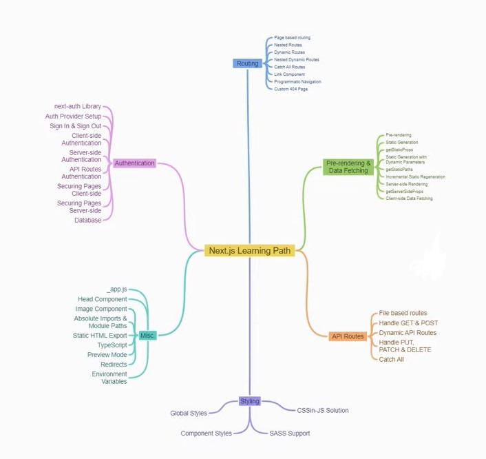

# Learn JAMstack ( Next Js ) Serverless in Baby Steps

Here we will learn to develop blazingly fast and scalable modern websites and apps using JAMstack, GraphQL and Serverless technologies. In this repo we will learn how to develop JAMstack Serverless Websites and Apps using Next.js, Headless CMS, Serverless Functions, Netlify, FaunaDB, Apollo, and GitHub Actions etc.

#### Step # 1 : Basics of Next Js and Routing

<ul>
  <li>Page based Routing</li>
  <li>Nested Routes</li>
  <li>Dynamic Routes</li>
  <li>Nested Dynamic Routes</li>
  <li>Catch All Routes</li>
  <li>Link Components</li>
  <li>Programmatic Navigation</li>
  <li>Custom 404 Page</li>
</ul>

#### Step # 2 : Pre Rendering and Data Fetching

<ul>
  <li>Pre Rendering</li>
  <li>Static Side Generation (SSG)</li>
  <li>getStaticProps</li>
  <li>Static Generation with Dynamic Parameters</li>
  <li>getStaticPaths</li>
  <li>Incremental Static Regeneration (ISR)</li>
  <li>Server Side Rendering (SSR)</li>
  <li>getServerSideProps</li>
  <li>Client Side Data Fetching</li>
</ul>

#### Step # 3 : API Routes

<ul>
  <li>File based Routes</li>
  <li>Handle GET & POST</li>
  <li>Dynamic API Routes</li>
  <li>Handle PUT, PATCH & DELETE</li>
  <li>Catch All</li>
</ul>

#### Step # 4 : Styling

<ul>
  <li>Global Styles</li>
  <li>Component Styles</li>
  <li>SASS Support</li>
  <li>CSS in JS Solution</li>
</ul>

#### Step # 5 : Miscellaneous

#### Step # 6 : Authentication

#### Step # 7 : Typescript and Testing

#### Step # 8 : Backend Integration

